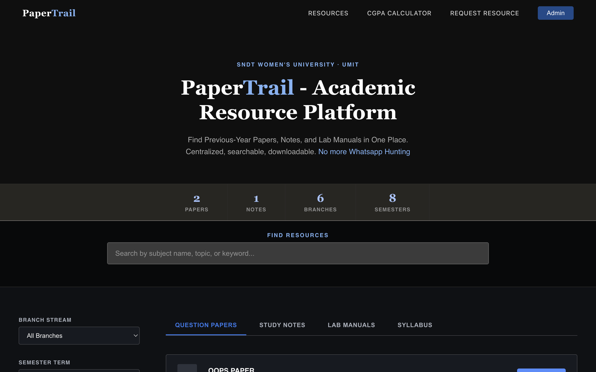
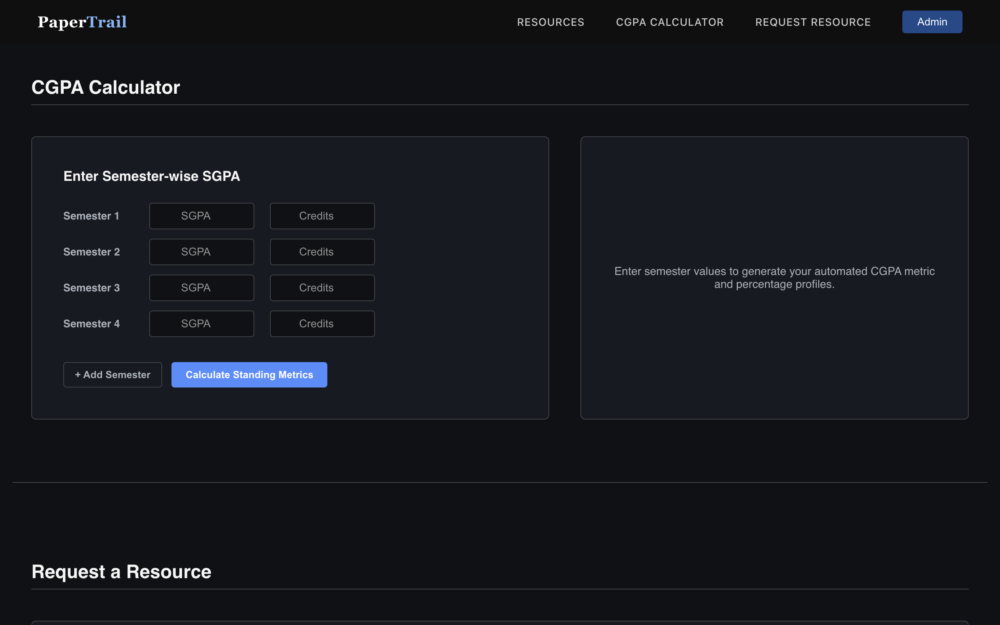
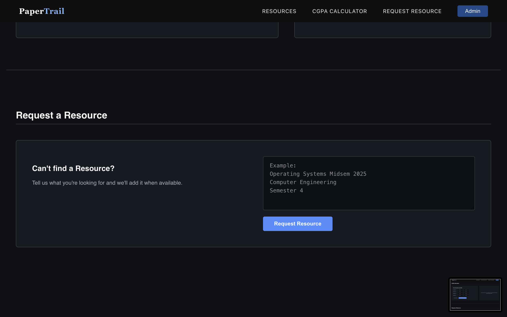

# 📑 PaperTrail Frontend

A responsive React-based frontend for **PaperTrail**, an academic resource platform that helps students quickly access previous-year question papers, study notes, lab manuals, and other learning resources from a single place.

Designed to replace scattered WhatsApp groups, shared drives, and manual searches with a centralized, searchable platform.

---

## 🌐 Live Demo

🔗 https://papertrail-frontend.vercel.app

---

## 📖 About the Project

PaperTrail was built to solve a common problem faced by university students—academic resources are often scattered across seniors, WhatsApp groups, personal drives, and library archives.

The platform provides a single interface where students can:

- Browse previous-year question papers
- Access study notes and lab manuals
- Search and filter academic resources
- Calculate their CGPA
- Request unavailable resources

The frontend communicates with a Spring Boot REST API backend to fetch and manage academic resources.

---

# ✨ Features

### 📄 Academic Resource Hub

- Browse Question Papers
- Browse Study Notes
- Browse Lab Manuals
- Browse Syllabus
- Filter resources by:
  - Branch
  - Semester
  - Academic Year
  - Resource Type
- Keyword search

---

### 🎓 CGPA Calculator

- Semester-wise SGPA input
- Credit-based CGPA calculation
- Automatic percentage conversion
- Dynamic result calculation

---

### 📝 Resource Request System

Students can request unavailable papers or notes.

Requests are forwarded to the administrator for future uploads.

---

### 🎨 Responsive Interface

- Dark themed modern UI
- Mobile responsive layout
- Smooth navigation
- Single Page Application (SPA)

---

## 🛠 Tech Stack

### Frontend

- React
- JavaScript (ES6+)
- HTML5
- CSS3

### Communication

- Axios
- REST APIs

### Deployment

- Vercel

---

# 📸 Screenshots

## 🏠 Home Page



---

## 🎓 CGPA Calculator



---

## 📝 Resource Request



---

# 🏗 Project Structure

```text
src/
│
├── components/
├── pages/
├── services/
├── assets/
├── styles/
└── App.js
```

---

# 🚀 Getting Started

## Clone the repository

```bash
git clone https://github.com/Ur-ka-shi/papertrail-frontend.git
```

```bash
cd papertrail-frontend
```

---

## Install dependencies

```bash
npm install
```

---

## Start the development server

```bash
npm start
```

The application will run on:

```
http://localhost:3000
```

---

# 🔗 Backend Repository

Spring Boot Backend:

https://github.com/Ur-ka-shi/papertrail-backend

---

# 🚀 Future Improvements

- User Authentication
- Bookmark Resources
- Download Analytics
- Resource Ratings
- Comments & Discussions
- Resource Verification
- Multi-college Support

---

## 👩‍💻 Author

**Urvashi Kamble**

Computer Engineering Student

SNDT Women's University

GitHub: https://github.com/Ur-ka-shi